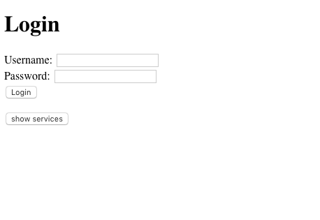

# FENIX API


The [Project](https://github.com/bmalbusca/ASIT/blob/master/API_project/README.md) consists in a Restful Web App served by microservices using Flask (microservices architecture). Exists microservices for each specific API services and the app was built using the concept of mobile code a.k.a Web App (Front-end: Html, Javascript, AJAX; Back-end: Flask). In this project you will find some features as the QR code reader, 0Auth and microservices caching. The QR code reading can be found at those repos:

- https://github.com/schmich/instascan
- https://github.com/nimiq/qr-scanner

The project source can be found at [bmalbusca/microservices/API_project/src/](https://github.com/bmalbusca/microservices/tree/master/API_project/src)

### Installation
You should have `python3` installed in your machine. 

1. Git clone:
   - Using HTTPS method: `git clone https://github.com/bmalbusca/microservices.git`

2. Create a virtual environment (optional)
   - Install virtualenv package: `pip install virtualenv`
   - Go to `src` folder: `cd ./microservices/API_project/src`
   - Create environment `.env`: `virtualenv .env`
   - Activate environment: `source .env/bin/activate`
   
   see more at: https://docs.python-guide.org/dev/virtualenvs/

3. Install python packages:
   
   > If you want to use a virtual environment, you sould make the installation inside the folder where your `.env` is located and, must be activated!  
     
     - `pip install json2html`
     - `pip install requests`
     - `pip install Flask`


### Usage

See the guidelines available at [API_project/src/README.md](https://github.com/bmalbusca/microservices/blob/master/API_project/src/README.md)


###   Screenshots


||
| :--: | 
_______

### References 

- https://github.com/xpmatteo/flask-microservice (Json vs Flask example)

- https://www.patricksoftwareblog.com/receiving-files-with-a-flask-rest-api/ (Request API)
- https://realpython.com/api-integration-in-python/ (Resquest adn Build API)
- https://www.freecodecamp.org/news/build-a-simple-json-api-in-python/ (Build API)
- http://zetcode.com/python/requests/ (True JSON management )
- https://riptutorial.com/flask/example/5832/receiving-json-from-an-http-request (JSON POST) 
- https://blog.miguelgrinberg.com/post/designing-a-restful-api-with-python-and-flask/page/5 (complete example)
- https://auth0.com/blog/developing-restful-apis-with-python-and-flask/ (Ultra complete example - w/ Auth0)
- https://www.geeksforgeeks.org/python-using-for-loop-in-flask/ (HTML vs Flask)
- https://medium.com/octopus-wealth/returning-json-from-flask-cf4ce6fe9aeb (Return JSON to HTML)
- https://blog.miguelgrinberg.com/post/designing-a-restful-api-with-python-and-flask/page/5 (API POST)
- https://towardsdatascience.com/flask-an-easy-access-door-to-api-development-2147ae694ceb (More POST and GET)
- https://realpython.com/python-json/ (json to python DataTypes)
- https://www.sicara.ai/blog/2018-05-25-build-serverless-rest-api-15-minutes-aws (AWS Json)
- https://sysadmins.co.za/basic-restful-api-server-with-python-flask/ (Database Flask)

- https://pythonise.com/series/learning-flask/flask-http-methods
- https://www.bogotobogo.com/python/python-REST-API-Http-Requests-for-Humans-with-Flask.php


- https://fenixedu.org/dev/api/#get-canteen (API canteen - Json)
>
> *@example:~*
> ``` curl -X GET -H 'Content-Type: application/json' https://fenix.tecnico.ulisboa.pt/api/fenix/v1/canteen ```
>
------------


Are you new to [Git?](https://github.com/bmalbusca/git_getting_started)  :wavy_dash:
-------------

